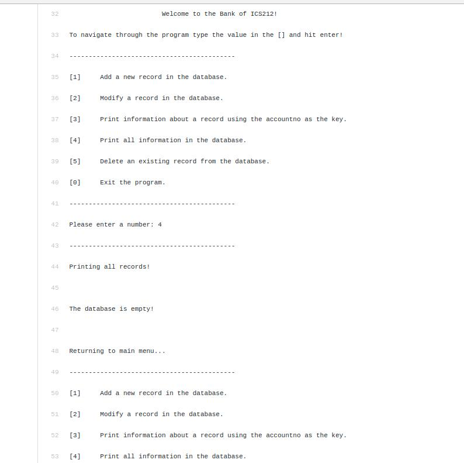

This is the final project in C that we had was a combination of all past assignments. This database can do basic actions a database should do, add, retrieve, and delete. We had been slowly building each part of the database and this was the final product of all the hard work. Our professor made it sure that when we would get an assignment, we would sit down and plan out how we would tackle the problem instead of writing code. This can be applied in future course and in the work field. It must much more time efficient to spend time thinking and planning out the solution instead of sitting down at the computer and start spouting out code. While that can work for little tasks, it is much harder to apply to bigger tasks.

Source: <a href="https://github.com/solliegarcia/c-database/"><i class="large github icon "></i>solliegarcia/c-database</a>
