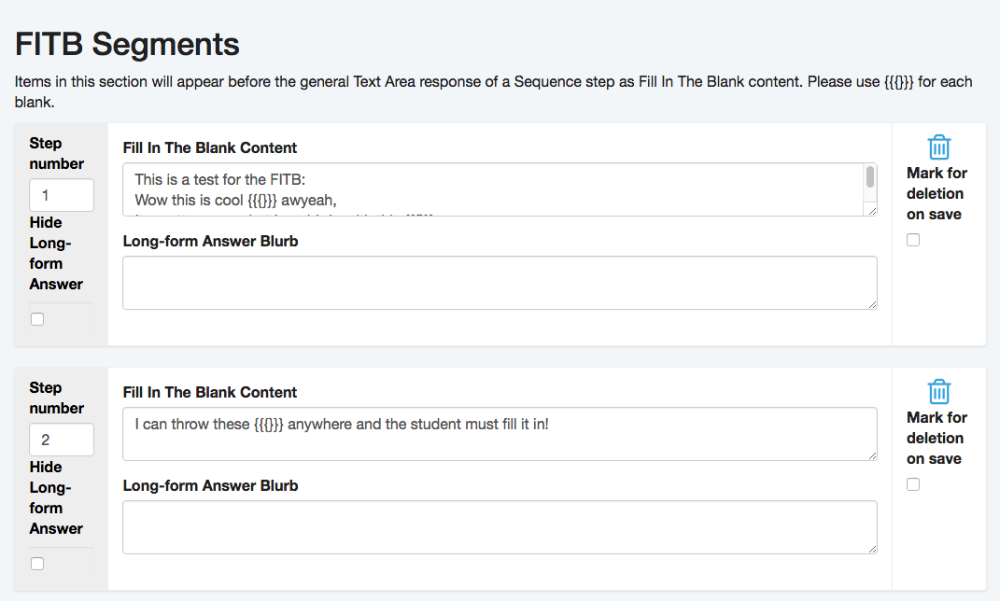
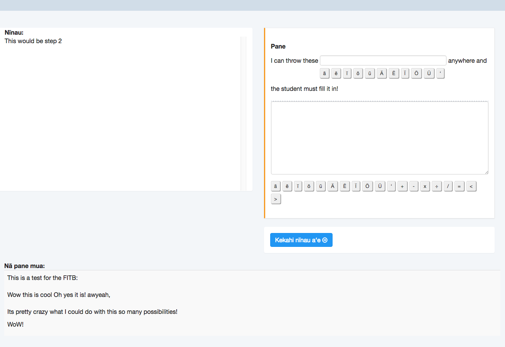

I joined the [Distance Course Design and Consulting](https://dcdc.coe.hawaii.edu/) group while Kaiapuni was slowing down in terms of primary features. Most of the testing features and grading was already implemented, however there were still a big wishlist from the client. Kaiapuni is an online platform created using the [Ruby on Rails](http://rubyonrails.org/) framework. I had to review thousands of lines of code and familiarize myself with the entire framework because prior to this, I had no experience with Ruby on Rails.

Within the first month, I was asked to add to an already existing problem type called "Sequenced Problems". These problems had multiple steps to them and once a student finished one step they would be redirected to the next with their previous answer still on the screen. What I had to implement was a "Fill in the Blank" (FITB) section that could be added to these problems. The FITB portion would be in the answer segment for each step.

Working with DCDC, I learned the process from the clients request, to project management through task managing, version control, to pushing up to the production server. I got a glimps at everything they had to offer, and are still learning new things everytime I step through the door. Following very specific standards when it comes to accessibility got frustrating, but were absolutely necessary.
