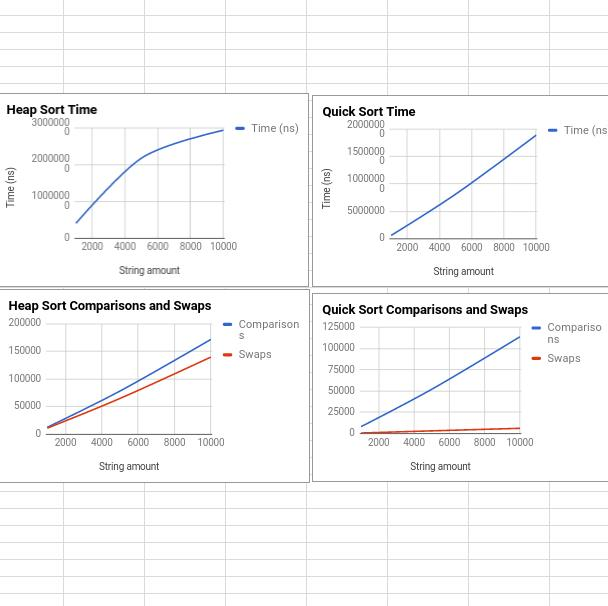

This project involved coding multiple sorting algorithms such as bubble sort, and quick sort in Java. We were then given a text file of 10,000 strings and we had to gather data on how each sort preformed on different sized sorts. This was the first time coding something and seeing my computer slightly stutter at computing something. Before that class, I was under the impression that my code will run at high speeds no matter what. It was interesting graphing all the data and seeing that no, not everything is efficient at high values such as these sorts.

Learning and seeing the Big(O) of these sorts made me keep efficiency in mind in everything I design. Can what I wrote handle high loads? That is an important question to always keep in mind, especially in my current workplace where we handle high query requests.  
